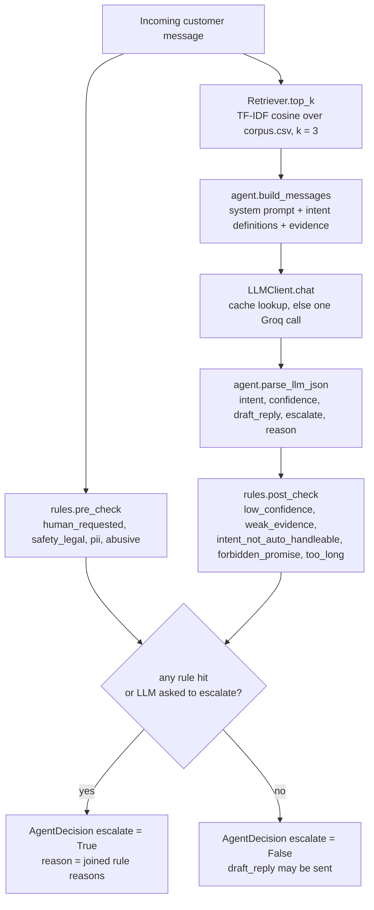
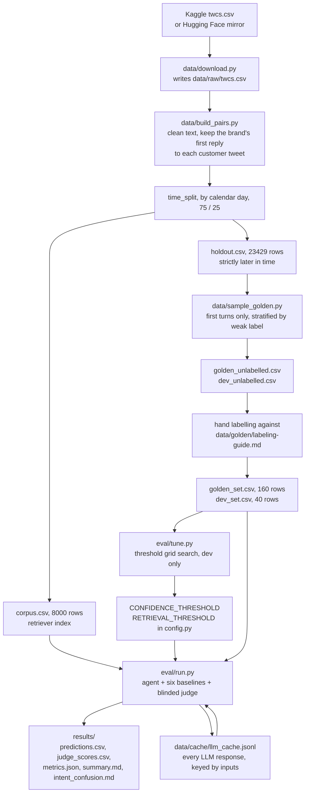

# Architecture

Two paths run through this repository. The **runtime path** is what happens to one incoming
customer message. The **offline path** is how the data, the golden set and the results are
produced. They share the same modules, so both are described here with the file that owns each
step.

## 1. Runtime path: one message to one decision

The shape is a sandwich: deterministic rules, one model call, deterministic rules. Nothing is
auto-sent unless every rule stays silent and the model itself did not ask for a human.

## 2. Offline path: raw dump to results

The only arrow that costs money is the one into `eval/run.py`. Every response it gets is written
to the cache, so a second run is free and a run that dies halfway resumes from where it stopped.

## 3. Components

### `config.py`
Responsibility: one place for every path, model id, threshold and seed. Inputs: environment
variables, optionally loaded from `.env`. Outputs: module-level constants plus `brand_dir()` and
`offline()`. It exists so a reviewer can change the brand, the model or a threshold without
grepping the code, and so the report can cite a single file when it says "the threshold is 0.3".

### `intents.py`
Responsibility: the intent taxonomy and a keyword weak labeller. Inputs: a message string.
Outputs: `INTENTS` (nine intents plus `other`, each with a definition, examples, an
`auto_handle_allowed` flag and keywords), `weak_label(text)`, and `definitions_block()` for the
prompt. It exists because three different consumers need the same taxonomy: the prompt, the
stratified sampler, and the simple intent baseline. `auto_handle_allowed` is the single fact that
connects the taxonomy to the escalation gate. `_distinct_hits` counts non-overlapping matched
spans so a nested phrase such as "double charged" votes once, not twice.

### `rules.py`
Responsibility: the deterministic half of the escalation decision. Inputs: for `pre_check`, the
raw message; for `post_check`, the parsed model output plus the retrieval score and the
thresholds. Outputs: a list of `RuleHit(rule, reason)`. It exists because a model's opinion about
its own confidence is not evidence. These rules are the part of the decision a human can read,
audit and change, and they are also the "simple" escalation baseline on their own.

### `retrieve.py`
Responsibility: find similar historical exchanges. Inputs: the corpus dataframe at construction,
a query string at call time. Outputs: up to `k` `Evidence` records with `pair_id`, the customer
text, the brand reply, and a cosine score in `[0, 1]`. It exists to ground the reply in what the
brand actually said before, and its top score doubles as an evidence-strength signal that
`post_check` reads. TF-IDF rather than embeddings: Groq exposes no embedding endpoint, and a
laptop-only fit keeps the reproduction inside the time budget.

### `llm.py`
Responsibility: the only module allowed to talk to a model. Inputs: a model id, a message list
and sampling parameters. Outputs: the raw response string. It does three jobs. It caches every
response in `data/cache/llm_cache.jsonl` under a SHA-256 of the exact inputs, which is what makes
`make reproduce` work with no API key. It spaces calls by a fixed minimum interval for the Groq
free tier. It converts a per-day rate-limit error into `DailyLimitError` so a run stops cleanly
and resumes tomorrow instead of crashing. A `transport` seam lets every test run without network.

### `agent.py`
Responsibility: the agent itself. Inputs: a message, plus an `LLMClient` and a `Retriever`.
Outputs: an `AgentDecision` carrying intent, confidence, draft reply, the escalation flag, a
reason, the evidence used, and the names of the rules that fired. It exists to hold the one
structured LLM call and to combine it with the rules. One call, not three, because intent, draft
and escalation share the same context and the free tier budget does not stretch to three calls
per message across a 200-row evaluation. `parse_llm_json` tolerates code fences and prose around
the JSON; an unparseable response is treated as confidence 0 and an escalation.

### `cli.py`
Responsibility: a one-message demo. Inputs: a message on the command line. Outputs: the decision
as JSON on stdout. It exists so the agent can be shown working without running the evaluation,
and so an interviewer can type a message and watch a rule fire.

### `data/download.py`
Responsibility: get `data/raw/twcs.csv` onto the machine. Inputs: nothing. Outputs: the raw CSV.
It tries the public Kaggle download endpoint first and falls back to a Hugging Face mirror, so a
grader with no Kaggle account can still rebuild from scratch. It is a no-op if the file is
already there.

### `data/build_pairs.py`
Responsibility: turn 2.8 million flat tweets into the pairs this project trains and retrieves on.
Inputs: the raw CSV and `config.BRAND`. Outputs: `corpus.csv` and `holdout.csv` under
`data/processed/<brand>/`. It cleans mentions, URLs and HTML entities, keeps only the brand's
first reply to each customer tweet, drops either side that cleans to under ten characters,
records how deep in a thread the customer message sits, and splits by calendar day so the holdout
is strictly later than the corpus. The day split exists to stop a retrieval agent from finding a
near-twin of the message it is being scored on.

### `data/sample_golden.py`
Responsibility: choose which held-out messages get hand-labelled. Inputs: `holdout.csv`. Outputs:
`golden_unlabelled.csv` and `dev_unlabelled.csv`. It samples first turns only, stratified by the
keyword weak label with a floor per stratum, then fills the rest at random. It exists because a
uniform sample of 160 rows would have been mostly `other` and catalogue questions, leaving the
rare intents unmeasurable. The weak label is used for sampling only; the labels that count were
written by hand afterwards.

### `baselines/intent.py`, `baselines/reply.py`, `baselines/escalation.py`
Responsibility: the two comparison points the assignment asks for on each task. Inputs and
outputs mirror the agent's, one task at a time. Trivial: majority intent, one canned reply,
escalate everything. Simple: TF-IDF plus logistic regression trained on weak labels, the nearest
neighbour's historical reply returned verbatim, and the rules layer alone. They exist so the
headline number has something to beat. The logistic regression is trained on weak labels, not
hand labels, so the golden set never touches training.

### `eval/metrics.py`
Responsibility: the automated numbers. Inputs: true and predicted lists. Outputs: for intent,
accuracy, macro-F1 over classes present, per-class scores and a confusion matrix; for escalation,
precision, recall, F1, missed and unnecessary escalation rates, automation rate, and a
cost-weighted error. It exists to keep scoring separate from running, and it is where the
`miss_cost = 5` assumption lives: auto-handling something that needed a human can hurt a
customer, while escalating unnecessarily only costs agent time.

### `eval/judge.py`
Responsibility: LLM-as-judge scoring of reply quality. Inputs: the customer message, the brand's
real reply, the evidence the candidate could use, and the candidate reply. Outputs: a
`JudgeScore` with five 1-5 integers, a one-sentence rationale, and a `parse_ok` flag. It exists
because no automated metric captures whether a support reply is sendable. The judge never learns
which system wrote the candidate, and a test asserts that no system name appears in the prompt.
Out-of-range values are clamped; `parse_ok` keeps a clamped `1` distinguishable from a genuine
worst score.

### `eval/agreement.py`
Responsibility: quantify how far the judge can be trusted. Inputs: two lists of scores. Outputs:
n, quadratic-weighted Cohen's kappa, Spearman rho, exact agreement and within-one agreement. It
exists so that judge scores are always reported next to evidence about the judge. Kappa is
quadratic-weighted because a 4-versus-5 disagreement matters far less than a 1-versus-5.

### `eval/run.py`
Responsibility: the whole evaluation in one command. Inputs: the golden CSV, the corpus, and an
`LLMClient`. Outputs: `predictions.csv`, `judge_scores.csv`, `metrics.json`, `summary.md` and
`intent_confusion.md` under the output directory. It runs the agent and all six baselines over
every golden row, judges three reply systems blind, computes every metric, and writes the tables
the report embeds. It stops cleanly on a daily cap and keeps what it already has, because every
call is cached.

### `eval/tune.py`
Responsibility: choose the two post-check thresholds. Inputs: `dev_set.csv`. Outputs: the best
confidence and retrieval threshold by cost-weighted error, with automation rate as the
tie-break. It calls the agent once per dev message with both thresholds set to zero, then
re-applies `post_check` post hoc across the grid, so the grid search costs one pass of LLM calls
rather than thirty-six. It reads the dev slice only. The golden set is never tuned on.

### `scripts/survey_brands.py`, `scripts/explore_intents.py`, `scripts/judge_consistency.py`
Responsibility: one-off analyses whose output is read by a person, not by the pipeline. The brand
survey produced the table in decision log entry 1. The intent explorer produced the clusters the
taxonomy was cut from. The judge consistency script re-scores forty agent replies at temperature
0.0 and 0.7 and reports how much the judge moves when nothing but sampling changed.

### `tests/`
Responsibility: keep the contracts honest offline. Every test runs without a network call, using
a fake transport for the LLM. `tests/test_golden_integrity.py` is the unusual one: it tests data,
not code, because a typo in an intent name or a `should_escalate` value that contradicts its
reason would silently corrupt every metric downstream.
